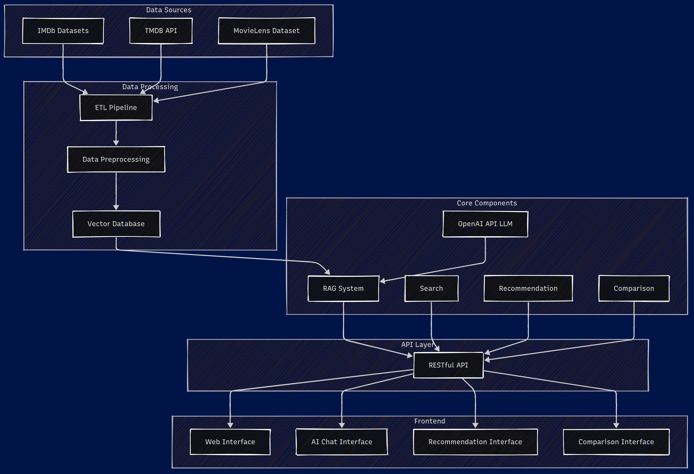

# Tenflix

A comprehensive RAG-powered system for movie and TV show recommendations that combines vector search, LLM integration, and personalized content discovery.

## Overview

This project demonstrates the implementation of a Retrieval-Augmented Generation (RAG) system for movie and TV show recommendations. The system combines structured metadata from multiple film databases with powerful vector search capabilities and large language model integration to create an intelligent, conversational recommendation platform.

## Features

- **Natural Language Search**: Ask questions about movies and shows in conversational language
- **Personalized Recommendations**: Get tailored recommendations based on preferences
- **Movie/Show Comparisons**: Compare multiple titles to understand similarities and differences
- **Semantic Content Discovery**: Find content based on themes, plot elements, and context

## Technical Architecture

The system consists of several core components:

1. **Data Pipeline**: Processes data from IMDb, TMDB, and MovieLens datasets
2. **Vector Database**: Stores embeddings for efficient semantic search
3. **RAG System**: Combines vector search with LLM capabilities for intelligent responses
4. **API Layer**: Provides RESTful endpoints for frontend communication
5. **Frontend UI**: React-based user interface for interacting with the system



## Technologies Used

- **Backend**: Python, FastAPI
- **Vector Database**: ChromaDB
- **LLM Integration**: OpenAI API (GPT-4o)
- **Frontend**: React, Tailwind CSS

## Screenshots

### Dashboard


### Search Results


### Chat


### Recommendations


### Comparison


## Getting Started

### Prerequisites

- Python 3.8+
- Node.js 16+
- OpenAI API key

```
movie-recommendation-system/
├── backend/
│   ├── app/
│   │   ├── data_pipeline.py   # ETL pipeline for processing movie data
│   │   ├── vector_database.py # Vector database implementation
│   │   ├── rag_system.py      # RAG system combining vector search and LLM
│   │   ├── main.py            # FastAPI application entry point
│   │   ├── models/            # Data models
│   │   └── routers/           # API endpoints
│   ├── data/                  # Raw data sources (not in repo)
│   └── processed_data/        # Processed data files 
├── frontend/
│   ├── src/
│   │   ├── components/        
│   │   ├── services/          
│   │   └── App.jsx            
│   ├── index.html
│   └── package.json
└── README.md
```

## Usage Examples
### Finding Movie Information
Ask about specific movies, directors, actors, or genres to get detailed information.
### Getting Recommendations
Tell the system about your preferences to receive personalized movie or TV show recommendations.
### Comparing Titles
Select multiple movies or shows to get a detailed comparison of their similarities and differences.


## Limitations

- Due to lack of GPU resources, the system is trained on a limited dataset (17,000 titles instead of the full dataset), which may result in lower quality recommendations
- The quality of recommendations depends on the comprehensiveness of the source data
- API rate limits may apply due to OpenAI API usage


## Future Enhancements

- User profiles and persistent recommendation history
- Image and trailer integration for a richer experience
- Training on the full dataset with GPU acceleration for more comprehensive and higher-quality recommendations

## Acknowledgments

- IMDb for their comprehensive movie and TV show dataset
- MovieLens for their user ratings dataset
- The Movie Database (TMDB) for additional metadata
